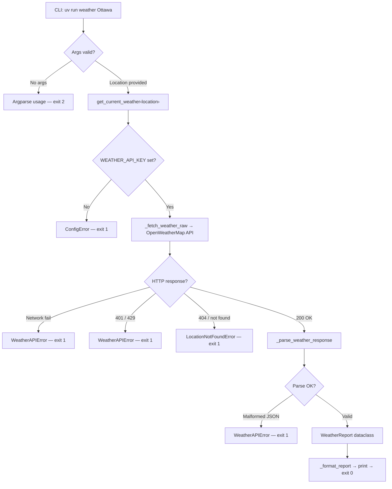

# Weather Tool — Project Outline

## Goal

Build a CLI weather tool that doubles as an agent-callable library. The weather is the excuse — the real lesson is: API integration, secrets hygiene, and clean library/CLI separation.

**Scope:** 2–3 weekends. If it feels bigger, something's crept in.

**The Rule:** Your API key must _never_ appear in source, logs, errors, or git history. Violate this and you start over.

---

## What You're Building

A Python package (`weather_tool`) with two consumers:

1. **CLI** — `uv run weather Ottawa` → human-readable output
2. **Library** — `from weather_tool import get_current_weather` → structured `WeatherReport` dataclass

Same core function serves both. The library is the capability; the CLI is just one frontend.

---

## File Structure

```
weather-tool/
├── src/weather_tool/
│   ├── __init__.py      # Re-exports public API
│   ├── types.py         # WeatherReport dataclass
│   ├── core.py          # Library logic + exceptions (NO print statements)
│   └── cli.py           # CLI frontend (ALL formatting lives here)
├── tests/
│   └── test_core.py     # Parser tests only — no network
├── .env.example         # Documents required vars, NO real values
├── .gitignore           # Must include .env
├── DECISIONS.md         # Phase 0 output
├── README.md            # Human docs
├── SKILL.md             # Agent docs
└── pyproject.toml       # Deps, scripts, config
```

---

## Program Flow



**Import direction rule:** `cli → core → types → stdlib`. If `core.py` imports `cli.py`, something has gone feral.

---

## Key Contracts

```python
# The function signature that matters:
get_current_weather(location: str) -> WeatherReport

# Good — tool owns its config:
get_current_weather("Ottawa")

# Bad — secrets near call surface:
get_current_weather("Ottawa", api_key="secret")  # NO.
```

```python
# Exception hierarchy:
WeatherToolError(Exception)         # Base — CLI catches this
├── ConfigError                     # Missing WEATHER_API_KEY
├── LocationNotFoundError           # API can't resolve location
└── WeatherAPIError                 # Network/API/parse failures
```

```python
# Return type:
@dataclass(frozen=True)
class WeatherReport:
    location: str          # Resolved name
    temperature_c: float   # Metric only
    feels_like_c: float
    humidity_pct: int      # 0–100
    wind_kph: float
    description: str       # e.g. "light rain"
    weather_id: int        # OWM weather code
```

---

## Build Phases

### Phase 0 — Decisions

**Goal:** Lock in choices before writing code. No code this phase.

**Do:**

- [ ] Sign up for OpenWeatherMap, get API key
- [ ] Run `pyinit` → creates project scaffold
- [ ] `uv add requests`
- [ ] Add `[project.scripts] weather = "weather_tool.cli:main"` to `pyproject.toml`
- [ ] Create `.env.example` with `WEATHER_API_KEY=your_key_here`
- [ ] Confirm `.env` is in `.gitignore`
- [ ] Write `DECISIONS.md` — document API choice, secret handling approach, error model, package layout

**Checkpoint:** You can explain every choice in `DECISIONS.md` without second-guessing it.

---

### Phase 1 — Walking Skeleton

**Goal:** CLI runs end-to-end with _stubbed_ data. No network calls. Fake but structurally correct output.

**Build:**

- `types.py` — `WeatherReport` dataclass (frozen, with `to_dict()`)
- `core.py` — Exception classes + stubbed `get_current_weather`:
    - Reads `WEATHER_API_KEY` from env (raises `ConfigError` if missing)
    - Returns hardcoded `WeatherReport` for any valid input
    - Raises `LocationNotFoundError` for input `"nowhere"` (test hook)
    - Zero `print()` calls in this file
- `cli.py` — argparse + `_format_report()` + `main()`:
    - Catches `WeatherToolError` → clean error message, exit 1
    - Does NOT catch bare `Exception`
    - All formatting/printing lives here
- `__init__.py` — Re-export public API with `__all__`

**Smoke tests:**

```bash
export WEATHER_API_KEY=dummy
uv run weather Ottawa          # Stubbed report
uv run weather "Tokyo, JP"     # Stubbed report
uv run weather nowhere         # Clean error, exit 1
unset WEATHER_API_KEY
uv run weather Ottawa          # ConfigError, exit 1
uv run weather                 # Argparse usage, exit 2
```

**Checkpoint:**

- [ ] All 5 commands above behave as described
- [ ] `from weather_tool import get_current_weather, WeatherReport` works in a REPL
- [ ] No tracebacks on expected failures
- [ ] `core.py` contains zero `print()` calls

---

### Phase 2 — Parser + Tests

**Goal:** Prove JSON→WeatherReport parsing works _before_ touching the network.

**Build:**

- `_parse_weather_response(raw: dict) -> WeatherReport` in `core.py`
- `tests/test_core.py` with three test cases:

|Test|What it proves|
|---|---|
|`test_parse_valid_response`|Realistic OWM JSON → correct `WeatherReport`|
|`test_parse_edge_values`|Negative temps, high wind, boundary humidity|
|`test_parse_malformed_response`|Bad input → `WeatherAPIError`, not `KeyError`|

**Rules:**

- Copy a real OWM response shape into your test fixtures
- Tests must pass with no internet
- `_parse_weather_response` is pure — no side effects, no network

```bash
uv run python -m pytest -v
```

**Checkpoint:**

- [ ] All tests green
- [ ] Tests run offline
- [ ] Malformed data raises `WeatherAPIError` (not `KeyError`)

**⚠️ Phase 2 tests MUST be green before starting Phase 3. Do not build live API logic on unproven parsing.**

---

### Phase 3 — Live API Integration

**Goal:** Replace the stub with real OpenWeatherMap calls.

**Build:**

- `_fetch_weather_raw(location: str, api_key: str) -> dict` in `core.py`
    - Uses `requests.get(url, params=params, timeout=10)` — always `params=`, never string concat
    - Catches `requests.RequestException` → wraps as `WeatherAPIError`
- Wire real `get_current_weather` — calls `_fetch_weather_raw` then `_parse_weather_response`
- Map OWM error codes:
    - 404 → `LocationNotFoundError`
    - 401 → `WeatherAPIError`
    - 429 → `WeatherAPIError`
    - Network failure → `WeatherAPIError`

**Gotchas:**

- OWM keys can take a few minutes to activate after signup
- Don't forget `units=metric` in params
- Never include the API key in exception messages

**Smoke tests:**

```bash
export WEATHER_API_KEY=<real_key>
uv run weather Ottawa              # Real data
uv run weather "London, UK"        # Real data
uv run weather "asdfghjkl"         # LocationNotFoundError
WEATHER_API_KEY=bogus uv run weather Ottawa  # WeatherAPIError
```

**Checkpoint:**

- [ ] Real weather data for valid locations
- [ ] Clean errors for bad location, bad key, no key
- [ ] `grep -rn "WEATHER_API_KEY" src/` shows no hardcoded values
- [ ] Parser tests still green
- [ ] No secrets in stdout/stderr/exceptions

---

### Phase 4 — Docs + SKILL.md + Polish

**Goal:** Make it portfolio-ready for humans and agents.

**Build:**

- `README.md` — setup, env var config, CLI usage, library usage, testing
- `SKILL.md` — trigger phrases, anti-triggers, function signature, return shape, error behavior, example interaction
- Final docstring pass on all public functions

**Polish checklist:**

- [ ] `grep -R "your_real_key" .` finds nothing
- [ ] `.env` is gitignored
- [ ] `.env.example` contains no real values
- [ ] `uv run python -m pytest -v` → green
- [ ] `uv run weather Ottawa` → real data
- [ ] Docstrings are accurate to actual behavior
- [ ] `SKILL.md` would correctly trigger on "weather in Tokyo" but NOT on "under the weather"

**Checkpoint:** You'd be comfortable pushing this to a public GitHub repo right now.

---

## Secrets Handling — The Non-Negotiable

This is the entire point of using an API that requires a key:

```
✅ API key lives in .env (runtime environment)
✅ Code references the variable name (WEATHER_API_KEY)
✅ .env.example documents what to set
✅ .env is gitignored
✅ Errors describe the problem, never the value

❌ Hardcoded keys
❌ Keys in function signatures
❌ Keys in logs, print statements, or exception messages
❌ Keys committed to git — ever, even "temporarily"
```

Before every commit: `git diff --cached | grep -i "key\|secret\|api"` — if anything real shows up, fix it before pushing.

---

## What's NOT in v1

No forecasts. No caching. No async. No multiple backends. No unit selection. No `--json` flag. No MCP server. No Telegram alerts.

All of those are good ideas. None of them belong in the first build. Ship v1, then pick one.

---

## Post-Build Reflection

Fill in after you've shipped:

- Did `core.py` stay print-free?
- Did the exception model feel right, or was it over/under-engineered?
- Could you drop this into another project as a callable tool without changes?
- Is the `SKILL.md` accurate to what you actually built?
- What would you steal from this skeleton for your next API tool?
