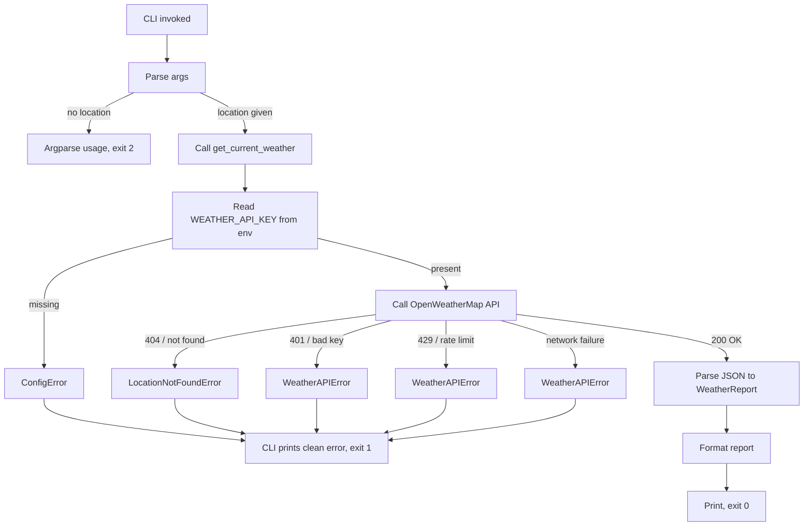

# OUTLINE.md — Weather Tool (Agent-Callable)

> **Tool-authorship template project.** Learning-first, but with a real portfolio angle: this is a working CLI weather tool _and_ a clean template for how to build agent-callable tools generally.
>
> The weather is the excuse. The reusable pattern is the point.
>
> **Scope discipline:** ~2–3 weekends. If it starts feeling bigger than that, something has crept in that does not belong.

---

## 1. Project Overview

**What we're building:** A small Python project that fetches current weather data from OpenWeatherMap and exposes that capability through two front-ends:

1. A **CLI** for humans:
   ```bash
   uv run weather Ottawa
   uv run weather "Tokyo, JP"
   ```

2. A **library** with agent-callable function signatures and a `SKILL.md` that teaches an LLM when and how to use the tool.

The same core function serves both. The library is the unit of capability; the CLI is one consumer.

**Primary use cases:**

- Human runs `weather <location>` from the terminal and gets readable output.
- An agent imports the library, calls the function, and receives structured data.
- Future projects can reuse this pattern for API-backed tools that require secrets.

**Core functionality:**

- Fetch current weather for a given location using OpenWeatherMap.
- Read the API key from the `WEATHER_API_KEY` environment variable.
- Return structured data via a dataclass.
- Format that data for human consumption via the CLI.
- Fail clearly on bad input, missing config, network errors, API errors, or unresolved locations.
- Ship with a `SKILL.md` documenting agent usage.
- Demonstrate safe local secrets handling without leaking credentials.

**Success criteria:**

- [ ] `uv run weather <location>` returns sensible human-readable output.
- [ ] `from weather_tool import get_current_weather; get_current_weather("Ottawa")` returns a structured `WeatherReport`.
- [ ] CLI handles missing/invalid arguments without tracebacks.
- [ ] Library raises clean, named exceptions.
- [ ] Tests pass for pure parsing logic.
- [ ] `SKILL.md` is written and accurate.
- [ ] No secrets are committed, printed, logged, or included in error output.
- [ ] Project follows the standard `pyinit()` / `uv` / `src/` structure.

**Why this matters:**

- Reps on the **library + CLI separation** pattern — the foundation for any tool that needs multiple front-ends.
- Reps on **function design for LLM consumption** — type hints, docstrings, structured returns, single responsibility.
- Reps on **safe API key handling** — env vars, `.env.example`, `.gitignore`, clean config errors, no secret leakage.
- Reps on **SKILL.md authorship** — teaching agents when to reach for a tool.
- Direct prep for Boot.dev's "Build an AI Agent in Python" course.
- Reusable template — the next tool you build starts from this skeleton.

---

## 2. Learning Objectives

| Objective | Proof Artifact | Self-Check Question |
|---|---|---|
| Separate library logic from CLI presentation | `core.py` has zero `print()` calls; `cli.py` does all formatting | "Could I write a Discord bot or agent wrapper without modifying `core.py`?" |
| Design function signatures for LLM consumption | Every public function has type hints + docstring with parameter and return descriptions | "If I gave only the docstring to an LLM, could it call this correctly?" |
| Return structured data, not strings | `get_current_weather` returns a dataclass, not a formatted string | "What does the return value look like in JSON?" |
| Handle secrets safely | API key is read from env var; `.env` is ignored; `.env.example` is safe | "If I pushed this repo to GitHub right now, would I leak anything?" |
| Author a `SKILL.md` that triggers correctly | Skill file with clear trigger phrases and anti-triggers | "Would this skill activate on 'what's the weather in Tokyo' but NOT on 'I feel under the weather'?" |
| Use custom exceptions deliberately | Clear exception hierarchy in `core.py` | "Can callers distinguish missing config from bad location from API failure?" |
| Basic pytest reps | Tests for pure parsing logic, no network | "Can my tests run with no internet?" |
| Use `uv` project workflow | Dependencies tracked in `pyproject.toml` and `uv.lock` | "Can I recreate the environment with `uv sync`?" |

All verifiable without AI.

---

## 3. Project Setup Assumptions

This project assumes the standard local Python setup created by your `pyinit()` zsh function.

Expected initial setup:

```bash
mkdir weather-tool
cd weather-tool
pyinit
```

Because `pyinit()` converts hyphens to underscores, this creates:

```text
weather-tool/
├── src/
│   └── weather_tool/
│       └── __init__.py
├── tests/
│   └── __init__.py
├── .gitignore
├── pyproject.toml
├── uv.lock
└── .venv/
```

This outline **does not replace** the standard setup. It assumes that setup exists and then adds the project-specific pieces.

**Project-specific manual changes after `pyinit()`:**

1. Add runtime dependency:
   ```bash
   uv add requests
   ```

2. Ensure dev dependencies are available:
   ```bash
   uv sync --extra dev
   ```

3. Add this to `pyproject.toml`:
   ```toml
   [project.scripts]
   weather = "weather_tool.cli:main"
   ```

4. Add `.env.example`:
   ```bash
   WEATHER_API_KEY=your_openweathermap_api_key_here
   ```

5. Ensure `.env` is ignored:
   ```text
   .env
   ```

6. Add project modules:
   ```text
   src/weather_tool/core.py
   src/weather_tool/types.py
   src/weather_tool/cli.py
   ```

**Why this approach:** Keep `pyinit()` general-purpose. Do not make it project-aware. A stable initializer plus a few deliberate manual edits is cleaner than a shell function that tries to become an oracle and inevitably grows antlers.

---

## 4. Architecture Decisions

### 4.1 Weather API

**Decision:** Use OpenWeatherMap Current Weather Data API.

**Why:**

- Requires an API key, which provides deliberate reps on secrets handling.
- Supports global city lookup.
- Simple enough for a small v1 tool.
- Similar pattern to future API-backed tools.
- Matches prior experience with small API projects such as ISS tracking.

**Tradeoff:** A no-key government API would reduce friction, but it dodges one of the main learning goals: protecting secrets in published tools.

### 4.2 Error model

**Decision:** Use custom exceptions in the library.

```python
class WeatherToolError(Exception): ...
class ConfigError(WeatherToolError): ...
class LocationNotFoundError(WeatherToolError): ...
class WeatherAPIError(WeatherToolError): ...
```

**Why:**

- Pythonic.
- Clear caller behavior.
- CLI can catch tool-specific errors cleanly.
- Agents can also catch or reason about named failures.
- Avoids unstructured `{"success": false}` style returns.

### 4.3 Return shape

**Decision:** Return a frozen dataclass.

```python
@dataclass(frozen=True)
class WeatherReport:
    ...
```

**Why:**

- Structured.
- Easy to inspect.
- Easy to convert to dict.
- Works well for agent-callable tools.
- Avoids mixing formatting with data retrieval.

### 4.4 Package layout

**Decision:** Use `src/weather_tool/`.

**Why:**

- Matches the standard `pyinit()` setup.
- Keeps imports honest.
- Works cleanly with `pyproject.toml`.
- Better long-term than a root-level package for reusable tools.

### 4.5 CLI entry point

**Decision:** Use a console script in `pyproject.toml`.

```toml
[project.scripts]
weather = "weather_tool.cli:main"
```

Run with:

```bash
uv run weather Ottawa
```

**Why:**

- Matches the desired `weather <location>` behavior.
- Avoids relying on `python cli.py`.
- Keeps CLI inside the package.

### 4.6 Secrets handling

**Decision:** Read the OpenWeatherMap API key from the runtime environment.

```bash
WEATHER_API_KEY=<real key>
```

**Never:**

- hardcode the key
- pass it through the public function signature
- commit it
- print it
- include it in exception messages
- include it in logs

**Mental model:**

```text
Secret belongs to runtime environment.
Code knows the variable name.
Docs explain how to set it.
Git never sees the value.
Errors never reveal the value.
```

---

## 5. Final File Structure

```text
weather-tool/
├── src/
│   └── weather_tool/
│       ├── __init__.py       # Re-export public API
│       ├── cli.py            # Human CLI front-end
│       ├── core.py           # Library logic: config, fetch, parse, exceptions
│       └── types.py          # WeatherReport dataclass
├── tests/
│   ├── __init__.py
│   └── test_core.py          # Parser tests, no network
├── .env.example              # Documents required env vars, no real values
├── .gitignore                # Must include .env
├── DECISIONS.md              # Phase 0 choices and rationale
├── README.md                 # Human usage documentation
├── SKILL.md                  # Agent usage documentation
├── OUTLINE.md                # This file
├── pyproject.toml            # Project metadata, deps, scripts, tool config
└── uv.lock                   # Lockfile managed by uv
```

**What's NOT here:**

- `requirements.txt` — not needed with `uv`, `pyproject.toml`, and `uv.lock`.
- Root-level `cli.py` — CLI belongs inside `src/weather_tool/cli.py`.
- `setup.py` — unnecessary with modern packaging.
- Async — one HTTP request does not need a tiny distributed circus.
- Caching — v2 only.
- Forecasts — v2 only.
- Multiple weather backends — v2 or never.

---

## 6. Dependency Graph

```text
weather_tool.cli.main()
  ├── depends on: argparse
  ├── depends on: weather_tool.core.get_current_weather()
  ├── depends on: weather_tool.core.WeatherToolError
  └── depends on: weather_tool.cli._format_report()

weather_tool.core.get_current_weather(location)
  ├── depends on: os.environ["WEATHER_API_KEY"]
  ├── depends on: weather_tool.core._fetch_weather_raw()
  ├── depends on: weather_tool.core._parse_weather_response()
  └── returns: weather_tool.types.WeatherReport

weather_tool.core._fetch_weather_raw(location, api_key)
  └── depends on: requests.get(..., params=..., timeout=10)

weather_tool.core._parse_weather_response(raw)
  └── depends on: weather_tool.types.WeatherReport

weather_tool.types.WeatherReport
  └── depends on: dataclasses
```

**Critical path:**

```text
WeatherReport
→ exception classes
→ get_current_weather stub
→ CLI wired to stub
→ parser tests
→ real HTTP fetch
→ docs + SKILL.md
```

**Import direction rule:**

```text
cli.py imports from core.py/types.py.
core.py imports from types.py.
types.py imports from stdlib only.
core.py never imports cli.py.
```

If `core.py` wants to print something, the abstraction has gone feral.

---

## 7. API / Contract Sketch

### `src/weather_tool/types.py`

```python
from dataclasses import asdict, dataclass
from typing import Any


@dataclass(frozen=True)
class WeatherReport:
    """
    Structured weather report for a single location.

    All fields use metric units. Convert downstream if needed.
    """

    location: str
    temperature_c: float
    feels_like_c: float
    humidity_pct: int
    wind_kph: float
    description: str
    weather_id: int

    def to_dict(self) -> dict[str, Any]:
        """Return a dict representation, useful for JSON serialization."""
        return asdict(self)
```

### `src/weather_tool/core.py`

```python
from weather_tool.types import WeatherReport


class WeatherToolError(Exception):
    """Base exception for weather tool failures."""


class ConfigError(WeatherToolError):
    """Raised when required configuration is missing or invalid."""


class LocationNotFoundError(WeatherToolError):
    """Raised when the API cannot resolve the requested location."""


class WeatherAPIError(WeatherToolError):
    """Raised when the weather API returns an unexpected error."""


def get_current_weather(location: str) -> WeatherReport:
    """
    Fetch current weather conditions for a location.

    Args:
        location: A city name or "city, country" string.
            Examples: "Ottawa", "Tokyo, JP", "London, UK".

    Returns:
        A WeatherReport with current conditions in metric units.

    Raises:
        ConfigError: If WEATHER_API_KEY is not set.
        LocationNotFoundError: If the location cannot be resolved.
        WeatherAPIError: If the API returns an unexpected error or is unreachable.
    """
    ...
```

### `src/weather_tool/cli.py`

```python
from weather_tool.core import WeatherToolError, get_current_weather
from weather_tool.types import WeatherReport


def main() -> int:
    """
    CLI entry point.

    Usage:
        weather Ottawa
        weather "Tokyo, JP"

    Returns:
        Process exit code.
    """
    ...


def _format_report(report: WeatherReport) -> str:
    """Format a WeatherReport for human-readable terminal output."""
    ...
```

**The contract that matters most:**

```python
get_current_weather(location: str) -> WeatherReport
```

That is the agent-callable capability.

Do **not** expose the API key in the public function signature. The tool owns its runtime config.

Good:

```python
get_current_weather("Ottawa")
```

Bad:

```python
get_current_weather("Ottawa", api_key="secret")
```

The second one puts secrets near tool-call surfaces. Avoid that unless there is a very specific reason.

---

## 8. Logic Flow Map



**Plain English flow:**

1. CLI starts and parses the location argument.
2. CLI calls `get_current_weather(location)`.
3. Library reads `WEATHER_API_KEY` from the environment.
4. Missing key raises `ConfigError`.
5. Library calls OpenWeatherMap using `requests.get(..., params=..., timeout=10)`.
6. API response is mapped to typed exceptions or parsed into a `WeatherReport`.
7. CLI formats the report and prints it.
8. CLI catches only `WeatherToolError` subclasses and exits cleanly.
9. Unexpected exceptions crash loudly because real bugs should not be politely swept under the rug.

---

## 9. Build Order Rationale

**Walking skeleton first.** Get the entire path runnable end-to-end with a stubbed API call before writing real HTTP code.

| Order | What | Why |
|---|---|---|
| 1 | `WeatherReport`, exceptions, stubbed `get_current_weather`, CLI | Establish contract and wiring |
| 2 | Parser function and parser tests | Prove JSON-to-dataclass logic without internet |
| 3 | Real `_fetch_weather_raw` | Replace stub with live API call |
| 4 | Error handling polish | Make failure boring |
| 5 | README + SKILL.md | Make it usable by humans and agents |

**Rule:** Never build something that calls a function that does not exist yet. Stubs first, real code second.

---

## 10. Implementation Phases

## Phase 0: Decisions

**Goal:** Lock in choices before scaffolding.

**Decisions:**

- [ ] API: OpenWeatherMap Current Weather Data API.
- [ ] Auth: `WEATHER_API_KEY` environment variable.
- [ ] Error model: custom exceptions.
- [ ] Package layout: `src/weather_tool/`.
- [ ] CLI entry point: `[project.scripts] weather = "weather_tool.cli:main"`.
- [ ] Return type: frozen `WeatherReport` dataclass.
- [ ] Units: metric only for v1.
- [ ] Tests: parser tests only, no network.
- [ ] HTTP: all requests use `params=` and `timeout=10`.

**Output:** `DECISIONS.md`.

**Definition of done:** You can explain why each choice was made without re-litigating it mid-build.

Suggested `DECISIONS.md` starter:

```markdown
# Decisions

## Weather API

Use OpenWeatherMap Current Weather Data API.

Reason:
- Requires API key, which gives deliberate practice with secret handling.
- Supports global city lookup.
- Simple enough for a first agent-callable tool.
- Matches future API-backed tools where env-var config will matter.

## Secret handling

The API key is read from the `WEATHER_API_KEY` environment variable.

The key must never be:
- committed to git
- printed to stdout/stderr
- included in exception messages
- hardcoded into source files

`.env` is gitignored.
`.env.example` documents the required variable name only.

## Error model

The library raises custom exceptions:
- `ConfigError`
- `LocationNotFoundError`
- `WeatherAPIError`

The CLI catches `WeatherToolError` and returns a clean non-zero exit code.

## Package layout

Use the standard local Python project structure created by `pyinit()`:

`src/weather_tool/`

## CLI

Expose the CLI with:

`[project.scripts] weather = "weather_tool.cli:main"`

Run with:

`uv run weather Ottawa`
```

---

## Phase 1: Walking Skeleton

**Goal:** Runnable CLI end-to-end with stubbed library function. No network calls yet. Returns fake but structurally correct data.

**What to build:**

- `src/weather_tool/types.py`
- `src/weather_tool/core.py`
- `src/weather_tool/cli.py`
- update `src/weather_tool/__init__.py`
- add `.env.example`
- update `.gitignore`
- update `pyproject.toml` console script

**Stub behavior:**

```python
def get_current_weather(location: str) -> WeatherReport:
    api_key = os.environ.get("WEATHER_API_KEY")

    if not api_key:
        raise ConfigError("WEATHER_API_KEY is not set")

    if location.lower() == "nowhere":
        raise LocationNotFoundError(f"Location not found: {location}")

    return WeatherReport(
        location=location,
        temperature_c=4.2,
        feels_like_c=1.0,
        humidity_pct=78,
        wind_kph=12.5,
        description="stubbed weather",
        weather_id=800,
    )
```

**Commands to run:**

```bash
export WEATHER_API_KEY=dummy
uv run weather Ottawa
uv run weather "Tokyo, JP"
uv run weather nowhere

unset WEATHER_API_KEY
uv run weather Ottawa

uv run weather
```

**Expected behavior:**

- Valid locations: formatted stubbed weather report.
- `nowhere`: clean `LocationNotFoundError`, exit 1.
- No env var: clean `ConfigError`, exit 1.
- No args: argparse usage, exit 2.
- No tracebacks for expected failures.

**Success criteria:**

- [ ] CLI runs end-to-end with stubbed data.
- [ ] `core.py` has zero `print()` calls.
- [ ] `cli.py` owns formatting and terminal output.
- [ ] `from weather_tool import get_current_weather, WeatherReport` works.
- [ ] `WeatherToolError` is caught by CLI.
- [ ] Bare `Exception` is not caught.
- [ ] `.env.example` exists.
- [ ] `.env` is gitignored.
- [ ] `uv run weather Ottawa` works.

**Common pitfalls:**

- Formatting strings inside `core.py`.
- Catching `Exception` in the CLI.
- Forgetting to wire `[project.scripts]`.
- Forgetting to run through `uv run`.
- Forgetting that `pyproject.toml` is the source of truth, not `requirements.txt`.

**Definition of done:** All commands above behave as expected.

---

## Phase 2: Tests for Parsing Logic

**Goal:** Prove JSON-to-`WeatherReport` parsing works against canned OpenWeatherMap responses before real HTTP code exists.

**What to build:**

- `_parse_weather_response(raw: dict) -> WeatherReport`
- `tests/test_core.py`

**Tests:**

1. Valid OpenWeatherMap response parses to expected `WeatherReport`.
2. Edge values parse correctly: cold temps, high wind, humidity bounds.
3. Malformed response raises `WeatherAPIError`, not `KeyError`.

**Important:** Tests must not call the real API.

**Commands:**

```bash
uv run python -m pytest -v
```

Optional sanity check:

```bash
# Run with internet off if you want to be absolutely sure.
uv run python -m pytest -v
```

**Success criteria:**

- [ ] All tests pass.
- [ ] No network access during tests.
- [ ] `_parse_weather_response` is pure.
- [ ] Tests use realistic OpenWeatherMap JSON shape.
- [ ] Malformed data raises `WeatherAPIError`.

**Definition of done:** Parser is green before any real HTTP code is written.

---

## Phase 3: Real API Integration

**Goal:** Replace the stub with a live OpenWeatherMap call.

**What to build:**

- `_fetch_weather_raw(location: str, api_key: str) -> dict`
- real `get_current_weather(location: str) -> WeatherReport`

**Required HTTP behavior:**

```python
requests.get(
    url,
    params=params,
    timeout=10,
)
```

**Rules:**

- Use `params=`, never string concatenation.
- Use `timeout=10`.
- Catch `requests.RequestException` and wrap in `WeatherAPIError`.
- Map OpenWeatherMap failures deliberately:
  - missing env var → `ConfigError`
  - unresolved location / 404 → `LocationNotFoundError`
  - bad key / 401 → `WeatherAPIError`
  - rate limit / 429 → `WeatherAPIError`
  - malformed success response → `WeatherAPIError`
- Never include the API key in exception messages.

**Commands:**

```bash
export WEATHER_API_KEY=<real_key>

uv run weather Ottawa
uv run weather "London, UK"
uv run weather "Tokyo, JP"
uv run weather "asdfghjkl"

WEATHER_API_KEY=bogus uv run weather Ottawa
```

**Success criteria:**

- [ ] Real weather data appears for valid locations.
- [ ] Bad location produces clean `LocationNotFoundError`.
- [ ] Bad API key produces clean `WeatherAPIError`.
- [ ] Network failure is wrapped as `WeatherAPIError`.
- [ ] All requests use `params=`.
- [ ] All requests use `timeout=10`.
- [ ] No secret appears in stdout, stderr, or exception text.
- [ ] Parser tests still pass.

**Common pitfalls:**

- API key activation delay after signup.
- OpenWeatherMap may return a JSON error body with a string error code.
- Forgetting `units=metric`.
- Letting raw `requests` exceptions leak through.
- Accidentally printing debug info containing the API key.

**Definition of done:** Real weather works, expected failures are clean, tests still pass.

---

## Phase 4: Documentation + SKILL.md + Polish

**Goal:** Make the project usable by humans and agents.

### `README.md`

Include:

- What this is.
- Setup:
  ```bash
  uv sync --extra dev
  uv add requests
  ```
- Environment variable:
  ```bash
  export WEATHER_API_KEY=<your_key>
  ```
- CLI usage:
  ```bash
  uv run weather Ottawa
  uv run weather "Tokyo, JP"
  ```
- Library usage:
  ```python
  from weather_tool import get_current_weather

  report = get_current_weather("Ottawa")
  print(report.temperature_c)
  ```
- Testing:
  ```bash
  uv run python -m pytest -v
  ```
- Secret-handling notes.
- Link to `SKILL.md` for agent integration.

### `SKILL.md`

Include:

- Trigger conditions.
- Anti-triggers.
- Available function signature.
- Return value shape.
- Error behavior.
- Example interaction.

### Final polish

- Read docstrings out loud.
- Confirm `.env` is ignored.
- Confirm `.env.example` is safe.
- Grep for accidental secrets:
  ```bash
  grep -R "YOUR_REAL_KEY_HERE" .
  ```
- Run:
  ```bash
  uv run python -m pytest -v
  uv run weather Ottawa
  ```

**Success criteria:**

- [ ] README is clear enough for another human.
- [ ] `SKILL.md` is clear enough for an agent.
- [ ] Public functions have useful docstrings.
- [ ] No secrets leak anywhere.
- [ ] Final CLI smoke test works.
- [ ] Repo is clean.

**Definition of done:** You would be comfortable linking this on GitHub.

---

## 11. Security Considerations

### Input validation

- Location is treated as a string and passed to OpenWeatherMap.
- Do not execute user-provided strings.
- Do not shell out.
- Do not use `eval`, `exec`, or `subprocess`.

### Secrets hygiene

- API key comes from `WEATHER_API_KEY`.
- `.env.example` documents the name only.
- `.env` is ignored.
- API key is never logged.
- API key is never printed.
- API key is never included in exceptions.
- Error messages name the condition, not the secret value.

### Error handling

- Library raises typed exceptions.
- CLI catches `WeatherToolError`.
- CLI does not catch bare `Exception`.
- Raw `requests` errors are wrapped in `WeatherAPIError`.
- Expected failures are clean.
- Real bugs crash.

### Dependency hygiene

- Runtime dependencies go in `pyproject.toml` through `uv add`.
- Dev dependencies are already defined by `pyinit()`.
- `uv.lock` is committed.
- Do not hand-edit `uv.lock`.

### Security checklist

- [ ] No API keys in source code.
- [ ] No API keys in README.
- [ ] No API keys in `DECISIONS.md`.
- [ ] No API keys in `SKILL.md`.
- [ ] `.env` ignored.
- [ ] `.env.example` safe.
- [ ] HTTP calls use `params=`.
- [ ] HTTP calls use `timeout=10`.
- [ ] No catch-all exception swallowing.
- [ ] No shell execution.
- [ ] No broad debug dumps of response/request objects.

---

## 12. Testing Strategy

Small project → small test suite.

Focus on parsing because it is the pure logic seam.

| Test | What it proves |
|---|---|
| `test_parse_weather_response_valid` | Happy path: realistic OpenWeatherMap JSON parses correctly |
| `test_parse_weather_response_edge_values` | Cold temps, high wind, odd but valid values |
| `test_parse_weather_response_malformed` | Bad input raises `WeatherAPIError` instead of leaking `KeyError` |

**Why only parser tests?**

- HTTP integration is better verified manually for this size of project.
- Mocking requests adds complexity without much payoff here.
- CLI wiring is simple enough for manual smoke testing.
- Parser is pure and worth testing.

**Test command:**

```bash
uv run python -m pytest -v
```

**Manual integration check:**

```bash
export WEATHER_API_KEY=<real_key>
uv run weather Ottawa
uv run weather "Tokyo, JP"
uv run weather nonexistentplace
WEATHER_API_KEY=bogus uv run weather Ottawa
```

---

## 13. Offline Runbook

### Phase 0

1. Confirm OpenWeatherMap account and key.
2. Read the Current Weather Data API docs.
3. Write `DECISIONS.md`.
4. Add `[project.scripts]` to `pyproject.toml`.
5. Add `.env.example`.
6. Confirm `.env` is ignored.

### Phase 1

1. Create `types.py`.
2. Create `core.py` with exception classes and stubbed `get_current_weather`.
3. Create `cli.py`.
4. Update `__init__.py`.
5. Run stub CLI commands.
6. Verify import in IPython:
   ```bash
   uv run ipython
   ```

   ```python
   from weather_tool import get_current_weather, WeatherReport
   ```

### Phase 2

1. Copy a realistic OpenWeatherMap response shape into tests.
2. Add `_parse_weather_response`.
3. Add parser tests.
4. Run `uv run python -m pytest -v`.

### Phase 3

1. Implement `_fetch_weather_raw`.
2. Wire real `get_current_weather`.
3. Map API and network failures.
4. Run live CLI checks.
5. Confirm no secret leaks.

### Phase 4

1. Write README.
2. Write SKILL.md.
3. Final docstring pass.
4. Run tests.
5. Run CLI.
6. Check git status.

---

## 14. Build Order Summary

| Phase | Modules | Tests | Milestone |
|---|---|---|---|
| 0 | `pyproject.toml`, `.env.example`, `DECISIONS.md` | — | Choices locked |
| 1 | `types.py`, `core.py`, `cli.py`, `__init__.py` | — | CLI runs with fake data |
| 2 | `_parse_weather_response` | `test_core.py` | Parser proven without network |
| 3 | `_fetch_weather_raw`, real `get_current_weather` | existing parser tests | Live API integration |
| 4 | `README.md`, `SKILL.md` | final test run | Shippable project |

**Critical rule:** Phase 2 tests must be green before Phase 3. Do not build live API logic on top of unproven parsing.

---

## 15. Future Enhancements

Explicitly **not** for v1.

| Enhancement | What it teaches | Prerequisite |
|---|---|---|
| `get_forecast(location, days)` | Adding a second agent-callable tool | V1 stable |
| `weather --json` | CLI output design for piping/tools | V1 stable |
| Unit selection | Parameter design | V1 stable |
| File-based caching with TTL | Freshness and idempotency | V1 stable |
| Multiple weather backends | Adapter pattern | V1 stable |
| MCP server wrapper | Modern agent tool delivery | V1 stable + MCP reading |
| Telegram rain alert | New consumer of the same library | V1 stable |
| OpenRouter/model API tool | More serious secrets handling | V1 stable |

Do **not** pull these into v1.

The Telegram alert is especially tempting because it connects to earlier rain-alert ideas. Resist. That belongs downstream as another consumer of the library, not bundled into the first build.

---

## 16. Post-Build Reflection

Fill this in after the build.

- Did the library/CLI separation stay clean?
- Did any formatting leak into `core.py`?
- Did the exception model feel right?
- Did the API-key handling feel clean?
- Did the CLI expose enough information without leaking internals?
- Did the `WeatherReport` fields cover what the CLI needed?
- Were the docstrings good enough to act as tool definitions?
- Was `SKILL.md` accurate after implementation?
- What from this project transfers directly to the next API-backed tool?
- Could this drop into the Boot.dev AI Agent project as a callable tool?

---

# Appendix A — TODO Checklist for Coding Agent

These are the exact TODOs to scaffold.

**Important:** Do not scaffold beyond Phase 1 in the initial pass. Let the human complete and review Phase 1 before generating Phase 2+ code.

```python
# Phase 0 human tasks:
# - Run pyinit in the project directory.
# - Run: uv add requests
# - Add [project.scripts] weather = "weather_tool.cli:main" to pyproject.toml.
# - Add .env.example with WEATHER_API_KEY=your_openweathermap_api_key_here.
# - Ensure .env is listed in .gitignore.
# - Write DECISIONS.md.

# src/weather_tool/types.py
# TODO [Phase 1]: Import dataclass, asdict, Any.
# TODO [Phase 1]: Define WeatherReport dataclass with frozen=True.
# TODO [Phase 1]: Fields: location, temperature_c, feels_like_c, humidity_pct, wind_kph, description, weather_id.
# TODO [Phase 1]: Add to_dict() method using asdict.
# TODO [Phase 1]: Add useful class docstring explaining metric units.

# src/weather_tool/core.py
# TODO [Phase 1]: Import os.
# TODO [Phase 1]: Import WeatherReport from weather_tool.types.
# TODO [Phase 1]: Define WeatherToolError(Exception) base class.
# TODO [Phase 1]: Define ConfigError, LocationNotFoundError, WeatherAPIError subclasses.
# TODO [Phase 1]: Implement get_current_weather(location: str) -> WeatherReport as a STUB.
# TODO [Phase 1]: Stub reads WEATHER_API_KEY from os.environ.
# TODO [Phase 1]: Stub raises ConfigError if WEATHER_API_KEY missing.
# TODO [Phase 1]: Stub raises LocationNotFoundError if location.lower() == "nowhere".
# TODO [Phase 1]: Stub returns hardcoded WeatherReport otherwise.
# TODO [Phase 1]: Add full docstring with Args, Returns, Raises, and Example sections.
# TODO [Phase 1]: Do not import cli.py.
# TODO [Phase 1]: Do not print from core.py.

# src/weather_tool/__init__.py
# TODO [Phase 1]: Re-export get_current_weather.
# TODO [Phase 1]: Re-export WeatherReport.
# TODO [Phase 1]: Re-export WeatherToolError, ConfigError, LocationNotFoundError, WeatherAPIError.
# TODO [Phase 1]: Define __all__ explicitly.

# src/weather_tool/cli.py
# TODO [Phase 1]: Import argparse and sys.
# TODO [Phase 1]: Import get_current_weather and WeatherToolError from weather_tool.core.
# TODO [Phase 1]: Import WeatherReport from weather_tool.types.
# TODO [Phase 1]: Set up argparse with one positional arg: location.
# TODO [Phase 1]: Implement _format_report(report: WeatherReport) -> str.
# TODO [Phase 1]: Implement main() -> int.
# TODO [Phase 1]: main() calls get_current_weather, formats, prints, returns 0.
# TODO [Phase 1]: Catch WeatherToolError specifically, print clean message, return 1.
# TODO [Phase 1]: Do not catch bare Exception.
# TODO [Phase 1]: Add if __name__ == "__main__": sys.exit(main()) for direct module execution.

# tests/
# TODO [Phase 1]: Do not add Phase 2 parser tests yet.

# Phase 2+:
# - Do not scaffold yet.
# - Generate after Phase 1 is working and reviewed.
```

---

# Appendix B — SKILL.md Template

Reference shape for the eventual `SKILL.md`.

Do not finalize until the actual behavior is locked in.

```markdown
# Weather Tool

Use this skill when the user asks about current weather conditions for a specific named location.

Triggers include:
- "What's the weather in Ottawa?"
- "Current temperature in Tokyo"
- "How cold is it in London right now?"
- "Is it raining in Toronto?"

Do NOT use this skill for:
- Climate questions
- Historical weather
- Forecasts beyond current conditions
- Weather alerts
- Metaphorical uses of "weather"
- Health phrases like "under the weather"

## Available functions

- `get_current_weather(location: str) -> WeatherReport`

Where `location` is a city name or "city, country" string.

Examples:
- `"Ottawa"`
- `"Tokyo, JP"`
- `"London, UK"`

## Return shape

Returns a `WeatherReport` dataclass with:

- `location`: resolved location name
- `temperature_c`: current temperature in Celsius
- `feels_like_c`: apparent temperature in Celsius
- `humidity_pct`: relative humidity, 0–100
- `wind_kph`: wind speed in km/h
- `description`: short text description
- `weather_id`: numeric OpenWeatherMap weather code

## Errors

- `ConfigError`: API key not configured. Tell the user the weather tool is not set up.
- `LocationNotFoundError`: location could not be resolved. Ask the user to specify city/country.
- `WeatherAPIError`: API/network problem. Tell the user weather data is temporarily unavailable.

## Example

User: "What's the weather in Ottawa right now?"

Agent calls:

`get_current_weather("Ottawa")`

Agent receives:

`WeatherReport(location="Ottawa, CA", temperature_c=4.2, feels_like_c=1.0, humidity_pct=78, wind_kph=12.5, description="light rain", weather_id=500)`

Agent responds:

"It's currently 4°C in Ottawa with light rain. Feels like 1°C. Humidity is 78%, wind is 12.5 km/h."
```

---

# Appendix C — Pattern Notes for Future Tools

What's reusable from this project:

1. `src/<tool_name>/` package layout.
2. `types.py` for return dataclasses.
3. `core.py` for callable capability.
4. `cli.py` as one consumer.
5. Exception hierarchy:
   - `<Tool>Error`
   - `ConfigError`
   - domain-specific failures
   - API/network failure
6. Env-var secret handling.
7. `.env.example` without real values.
8. `SKILL.md` alongside `README.md`.
9. `_parse_*` as the pure testable seam.
10. CLI catches tool errors; library never prints.

For the next API-backed tool, copy the pattern, rename the package, replace API logic, keep the boundaries.

